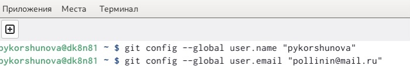
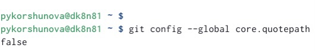
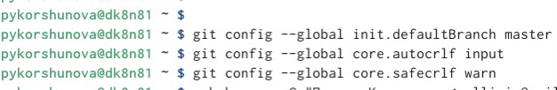
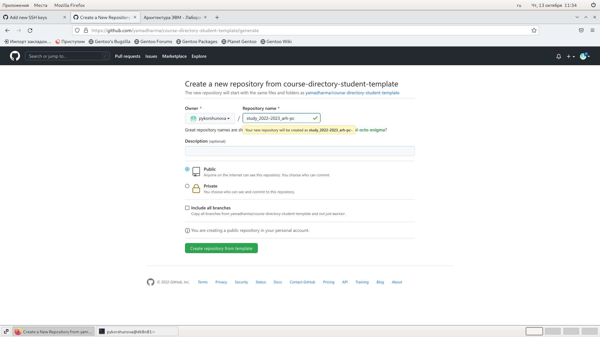

---
## Front matter
title: "ОТЧЕТ ПО ЛАБОРАТОРНОЙ РАБОТЕ No3"
subtitle: "Система контроля версий Git"
author: "Коршунова Полина Юрьевна"

## Generic otions
lang: ru-RU
toc-title: "Содержание"

## Bibliography
bibliography: bib/cite.bib
csl: pandoc/csl/gost-r-7-0-5-2008-numeric.csl

## Pdf output format
toc: true # Table of contents
toc-depth: 2
lof: true # List of figures
lot: true # List of tables
fontsize: 12pt
linestretch: 1.5
papersize: a4
documentclass: scrreprt
## I18n polyglossia
polyglossia-lang:
  name: russian
  options:
	- spelling=modern
	- babelshorthands=true
polyglossia-otherlangs:
  name: english
## I18n babel
babel-lang: russian
babel-otherlangs: english
## Fonts
mainfont: PT Serif
romanfont: PT Serif
sansfont: PT Sans
monofont: PT Mono
mainfontoptions: Ligatures=TeX
romanfontoptions: Ligatures=TeX
sansfontoptions: Ligatures=TeX,Scale=MatchLowercase
monofontoptions: Scale=MatchLowercase,Scale=0.9
## Biblatex
biblatex: true
biblio-style: "gost-numeric"
biblatexoptions:
  - parentracker=true
  - backend=biber
  - hyperref=auto
  - language=auto
  - autolang=other*
  - citestyle=gost-numeric
## Pandoc-crossref LaTeX customization
figureTitle: "Рис."
tableTitle: "Таблица"
listingTitle: "Листинг"
lofTitle: "Список иллюстраций"
lotTitle: "Список таблиц"
lolTitle: "Листинги"
## Misc options
indent: true
header-includes:
  - \usepackage{indentfirst}
  - \usepackage{float} # keep figures where there are in the text
  - \floatplacement{figure}{H} # keep figures where there are in the text
---

# Цель работы

В ходе данной лабораторной работы я планирую изучить идеологию
и применение средств контроля версий, приобрести практические
навыки по работе с системой git.

# Выполнение лабораторной работы

1)Базовая настройка git

1. Создаем учетную запись на github.com и заполняем основные данные 

2. Делаем предварительную конфигурацию git. Для этого входим в терминал и вводим команды (рис. [-@fig:001]) 

{ #fig:001 width=90% }

3. Настраиваем utf-8 в выводе сообщений git (рис. [-@fig:002])

{ #fig:002 width=90% }

4. Зададим имя начальной ветки (будем называть её master), параметры autocrlf и safecrlf (рис. [-@fig:003])

{ #fig:003 width=90% }

2)Создание SSH ключа

1. Для последующей идентификации пользователя на сервере
репозиториев генерируем пару ключей (приватный и открытый).
Ключи сохраняться в каталоге ~/.ssh/. Далее загружаем
сгенерированный открытый ключ. Заходим на github.org под своей
учетной записью и переходим в меню Setting. После этого выбираем
в боковом меню SSH и GPG keys и нажимаем кнопку New SSH key,
скопировав из локальной консоли ключ в буфер обмена (рис. [-@fig:004]) 

{ #fig:004 width=90% }

2. Вставляем ключ в появившемся на сайте поле и указываем для ключа имя (Title) (рис. [-@fig:005]) (рис. [-@fig:006])

{ #fig:005 width=90% }

{ #fig:006 width=90% }

3) Сознание рабочего пространства и репозитория курса на основе шаблона

1. Создаем каталог для предмета «Архитектура компьютера» (рис. [-@fig:007])

{ #fig:007 width=90% }

2. Переходим на станицу репозитория с шаблоном курса
https://github.com/yam adharma/course-directory-student-template. Далее
выбираем “Use this template”. В открывшемся окне задаем имя
репозитория (Repository name) study_2022–2023_arh-
pcисоздайтерепозиторий (кнопка Create repository from template) (рис. [-@fig:008]) (рис. [-@fig:009])

{ #fig:008 width=90% }

{ #fig:009 width=90% }

3. Открываем терминал и переходим в каталог курса, клонируем
созданный репозиторий (рис 3.5). Ссылку для клонирования можно
скопировать на странице созданного репо- зитория Code -> SSH (рис. [-@fig:010]) 

{ #fig:010 width=90% }
 
 

4) Настройка каталога курса

1. Переходим в каталог курса (cd ~/work/study/2022-
2023/"Архитектура компьютера"/arch-pc), удаляем лишние файлы (rmpackage.json), создаем необходимые каталоги (echo arch-pc >
COURSE, make) (рис. [-@fig:011])

{ #fig:011 width=90% }

2. Отправляем файлы на сервер (рис. [-@fig:012]) (рис. [-@fig:013]) 

  { #fig:012 width=90% }
 
![предварительная кофигурация] (image/index13.jpg){ #fig:013 width=90% }

3. Проверяем правильность создания всех каталогов на github (рис. [-@fig:014])

{ #fig:014 width=90% }

5) Задание для самостоятельной работы

1. Копирую отчеты по выполнению предыдущих лабораторных
работ в соответствующие каталоги созданного рабочего
пространства (labs-lab01-report и labs-lab02-report
соответственно). Далее с помощью последовательности команд
загружаю файлы файлы в github: “git add”, “git commit -am ‘add
lab01 and add lab02’ ” и “git push” (рис. [-@fig:015]) (рис. [-@fig:016]) 

  { #fig:015 width=90% }
  
  { #fig:016 width=90% }

2. Также данный отчет переносим в labs-lab03-report. После этого
загружаем на github с помощью аналогичной
последовательности команд.![переход в каталог курса]

# Выводы

В ходе данной лабораторной работы я изучила идеологию и
применение средств контроля версий, приобрела практические
навыки по работе с системой git.

::: {#refs}
:::
