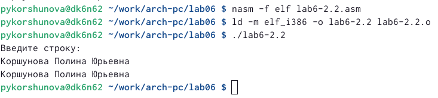

---
## Front matter
title: "Отчет по лабараторной работе No6"
subtitle: "Основы работы с Midnight Commander (mc). Структура программы на языке ассемблера NASM. Системные вызовы в ОС GNU Linux"
author: "Коршунова Полина Юрьевна"

## Generic otions
lang: ru-RU
toc-title: "Содержание"

## Bibliography
bibliography: bib/cite.bib
csl: pandoc/csl/gost-r-7-0-5-2008-numeric.csl

## Pdf output format
toc: true # Table of contents
toc-depth: 2
lof: true # List of figures
lot: true # List of tables
fontsize: 12pt
linestretch: 1.5
papersize: a4
documentclass: scrreprt
## I18n polyglossia
polyglossia-lang:
  name: russian
  options:
	- spelling=modern
	- babelshorthands=true
polyglossia-otherlangs:
  name: english
## I18n babel
babel-lang: russian
babel-otherlangs: english
## Fonts
mainfont: PT Serif
romanfont: PT Serif
sansfont: PT Sans
monofont: PT Mono
mainfontoptions: Ligatures=TeX
romanfontoptions: Ligatures=TeX
sansfontoptions: Ligatures=TeX,Scale=MatchLowercase
monofontoptions: Scale=MatchLowercase,Scale=0.9
## Biblatex
biblatex: true
biblio-style: "gost-numeric"
biblatexoptions:
  - parentracker=true
  - backend=biber
  - hyperref=auto
  - language=auto
  - autolang=other*
  - citestyle=gost-numeric
## Pandoc-crossref LaTeX customization
figureTitle: "Рис."
tableTitle: "Таблица"
listingTitle: "Листинг"
lofTitle: "Список иллюстраций"
lotTitle: "Список таблиц"
lolTitle: "Листинги"
## Misc options
indent: true
header-includes:
  - \usepackage{indentfirst}
  - \usepackage{float} # keep figures where there are in the text
  - \floatplacement{figure}{H} # keep figures where there are in the text
---

# Цель работы

В ходе данной лабораторной работы я хочу приобрести практические навыки работы в Midnight Commander, освоить инструкции языка ассемблера mov и int.

# Выполнение лабораторной работы

1. Открываю Midnight Commander и с помощью команды F7 создаю папку lab06 (рис. [-@fig:001])

{ #fig:001 width=90% }

2. Пользуясь строкой ввода и командой touch создаю файл lab6-1.asm (рис. [-@fig:002])

{ #fig:002 width=90% }

3. С помощью функциональной клавиши F4 открываю файл lab6-1.asm для редактирования во встроенном редакторе nano (рис. [-@fig:003])

{ #fig:003 width=90% }

4. Ввожу текст программы из листинга 6.1. С помощью функциональной клавиши F3 открываю файл lab6-1.asm для просмотра. Убеждаюсь, что файл содержит текст программы.(рис. [-@fig:004])

{ #fig:004 width=90% }

5. Транслирую текст программы lab6-1.asm в объектный файл. Выполняю компоновку объектного файла и запускаю получившийся исполняемый файл. На запрос ввожу ФИО (рис. [-@fig:005])

{ #fig:005 width=90% }

6. Скачиваю файл in_out.asm со страницы курса в ТУИС и копирую его в каталог с файлом lab6-1.asm с помощью функциональной клавиши F5 (рис. [-@fig:006])

{ #fig:006 width=90% }

7. С помощью функциональной клавиши F6 создаю копию файла lab6-1.asm с именем lab6-2.asm.(рис. [-@fig:007])

{ #fig:007 width=90% }

8. Исправляю текст программы в файле lab6-2.asm с использование подпрограмм из внешнего файла in_out.asm в соответствии с листингом 6.2.(рис. [-@fig:008]) 

{ #fig:008 width=90% }

9. Проверяю работу файла  lab6-2.asm (рис. [-@fig:009]) 

{ #fig:009 width=90% }

10. Выполняю задания для самостоятеьной работы. Создаю копию файла lab6-1.asm. Вношу изменения в программу (без использования внешнего файла in_out.asm), так чтобы она работала по
следующему алгоритму:
• вывести приглашение типа “Введите строку:”;
• ввести строку с клавиатуры;
• вывести введённую строку на экран. (рис. [-@fig:010]) 

{ #fig:010 width=90% }

11. Проверяю работу файла  lab6-3.asm (рис. [-@fig:011]) 

{ #fig:011 width=90% }

12. Создаю копию файла lab6-2.asm. Исправляю текст программы с использование подпрограмм из внешнего файла in_out.asm, так чтобы она работала по следующему алгоритму:
• вывести приглашение типа “Введите строку:”;
• ввести строку с клавиатуры;
• вывести введённую строку на экран. (рис. [-@fig:012]) 

{ #fig:012 width=90% }

13. Проверяю работу файла  lab6-2.2.asm (рис. [-@fig:013])

{ #fig:013 width=90% }

# Выводы

В ходе данной лабораторной работы я приобрела практические навыки работы в Midnight Commander, освоить инструкции языка ассемблера mov и int.

