---
## Front matter
title: "Отчет по лабораторнаой работе No7."
subtitle: "Арифметические операции в NASM"
author: "Коршунова Полина Юрьевна"

## Generic otions
lang: ru-RU
toc-title: "Содержание"

## Bibliography
bibliography: bib/cite.bib
csl: pandoc/csl/gost-r-7-0-5-2008-numeric.csl

## Pdf output format
toc: true # Table of contents
toc-depth: 2
lof: true # List of figures
lot: true # List of tables
fontsize: 12pt
linestretch: 1.5
papersize: a4
documentclass: scrreprt
## I18n polyglossia
polyglossia-lang:
  name: russian
  options:
	- spelling=modern
	- babelshorthands=true
polyglossia-otherlangs:
  name: english
## I18n babel
babel-lang: russian
babel-otherlangs: english
## Fonts
mainfont: PT Serif
romanfont: PT Serif
sansfont: PT Sans
monofont: PT Mono
mainfontoptions: Ligatures=TeX
romanfontoptions: Ligatures=TeX
sansfontoptions: Ligatures=TeX,Scale=MatchLowercase
monofontoptions: Scale=MatchLowercase,Scale=0.9
## Biblatex
biblatex: true
biblio-style: "gost-numeric"
biblatexoptions:
  - parentracker=true
  - backend=biber
  - hyperref=auto
  - language=auto
  - autolang=other*
  - citestyle=gost-numeric
## Pandoc-crossref LaTeX customization
figureTitle: "Рис."
tableTitle: "Таблица"
listingTitle: "Листинг"
lofTitle: "Список иллюстраций"
lotTitle: "Список таблиц"
lolTitle: "Листинги"
## Misc options
indent: true
header-includes:
  - \usepackage{indentfirst}
  - \usepackage{float} # keep figures where there are in the text
  - \floatplacement{figure}{H} # keep figures where there are in the text
---

# Цель работы

Освоение арифметических инструкций языка ассемблера NASM.

# Выполнение лабораторной работы

1. Создаю каталог для программ лабораторной работы No 7, перехожу в него и создаю файл lab7-1.asm (рис. [-@fig:001])

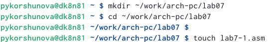{ #fig:001 width=90% }

2. Ввожу в файл lab7-1.asm текст программы из листинга 7.1. (рис. [-@fig:002])

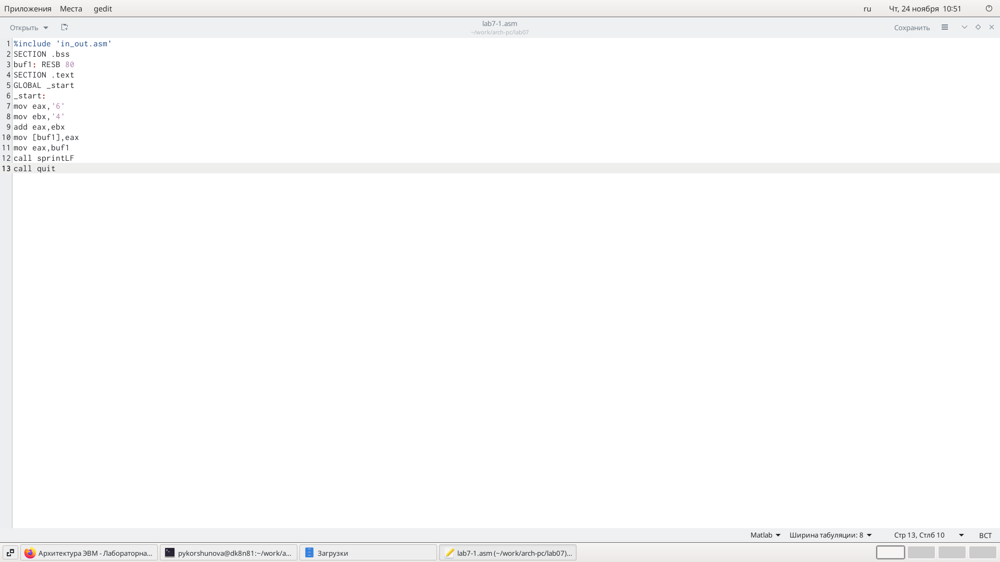{ #fig:002 width=90% }

3. Проверяю результат (рис. [-@fig:003])

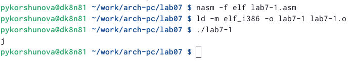{ #fig:003 width=90% }

4. Далее изменяю текст программы и вместо символов записываю в регистры числа (рис. [-@fig:004])

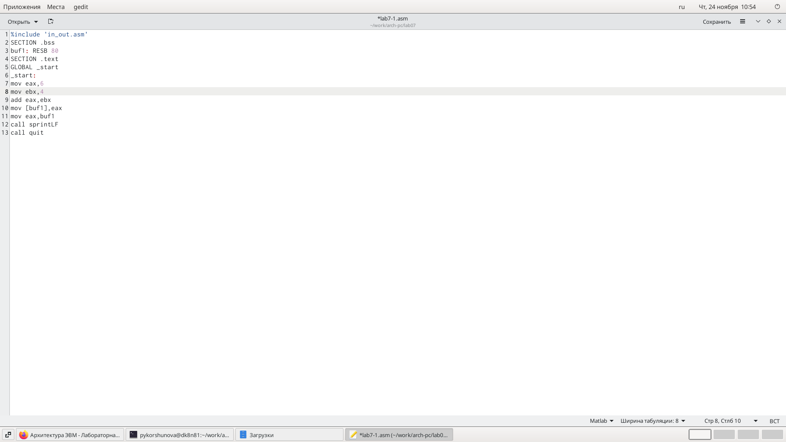{ #fig:004 width=90% }

5. Проверяю результат (рис. [-@fig:005])

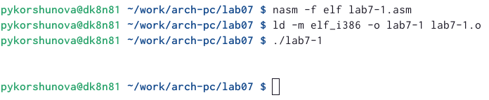{ #fig:005 width=90% }

6. Создаю файл lab7-2.asm в каталоге ~/work/arch-pc/lab07 и ввожу в него текст программы из листинга 7.2 (рис. [-@fig:006])

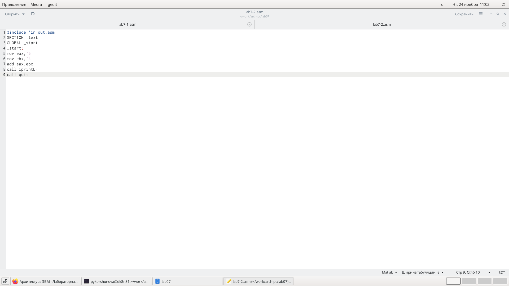{ #fig:006 width=90% }

7. Проверяю результат (рис. [-@fig:007])

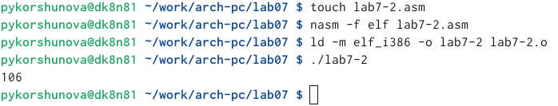{ #fig:007 width=90% }

8. Аналогично предыдущему примеру изменим символы на числа и запустим программу. Получим 10 (рис. [-@fig:008])

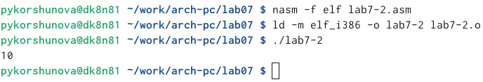{ #fig:008 width=90% }

9. Заменяю функцию iprintLF на iprint (рис. [-@fig:009])

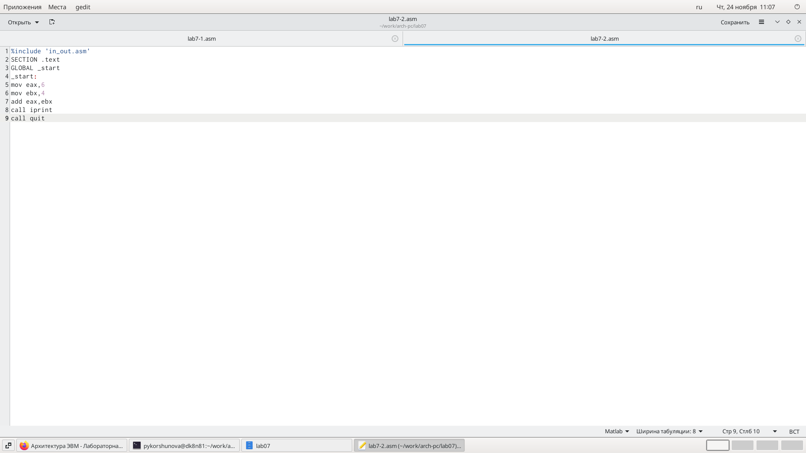{ #fig:009 width=90% }

10. Проверяю результат (рис. [-@fig:010])

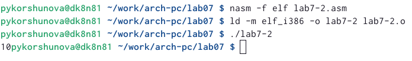{ #fig:010 width=90% }

11. Создаю файл lab7-3.asm в каталоге ~/work/arch-pc/lab07 и внимательно изучаю текст программы из листинга 7.3 и ввожу в lab7-3.asm (рис. [-@fig:011])

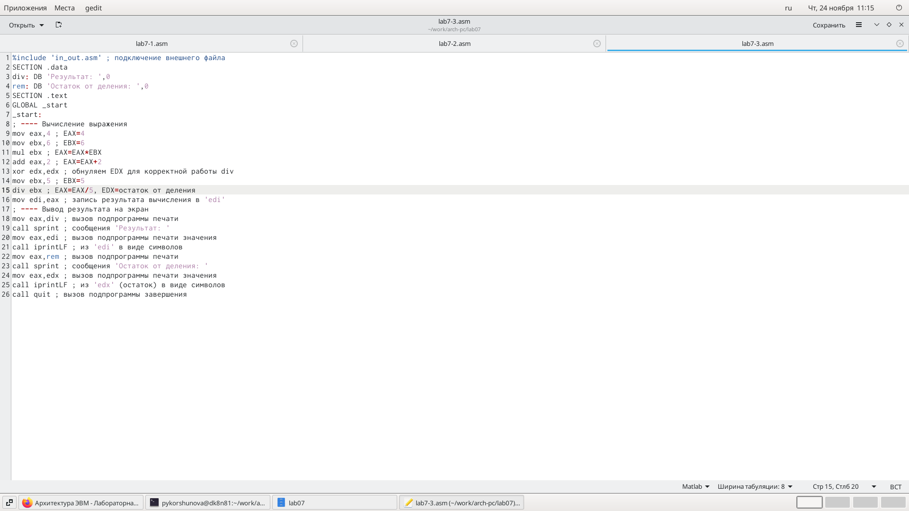{ #fig:011 width=90% }

12. Проверяю результат (рис. [-@fig:012])

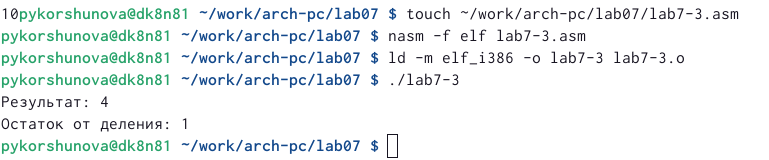{ #fig:012 width=90% }

13. Изменяю текст программы для вычисления выражения 𝑓(𝑥) = (4 ∗ 6 + 2)/5. Создайтю исполняемый файл и проверяю его работу (рис. [-@fig:013])

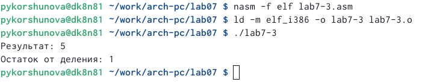{ #fig:013 width=90% }

14. Создаю файл variant.asm в каталоге ~/work/arch-pc/lab07, внимательно изучаю текст программы из листинга 7.4 и ввожу в файл variant.asm. Проверяю результат (рис. [-@fig:014])

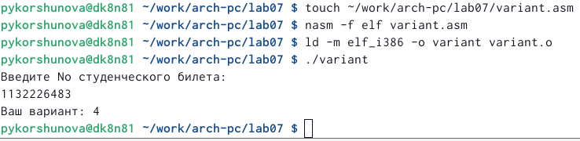{ #fig:014 width=90% }

# Ответы на вопросы

1. mov eax,msg call sprintLF

2. Эти инструкции используются для ввода переменной Х с клавиатуры и сохранения введенных данных

3. Эта инструкция используется для преобразования кода переменной ASCII в число

4. mov ebx,20 div ebx inc edx

5. В регистре ebx

6. Для увеличения значения edx на 1

7. mov eax,edx call iprintLF

# Выполнение задания для самостоятельной работы
 
1. Пишу программу вычисления выражения по своему варианту (рис. [-@fig:015])

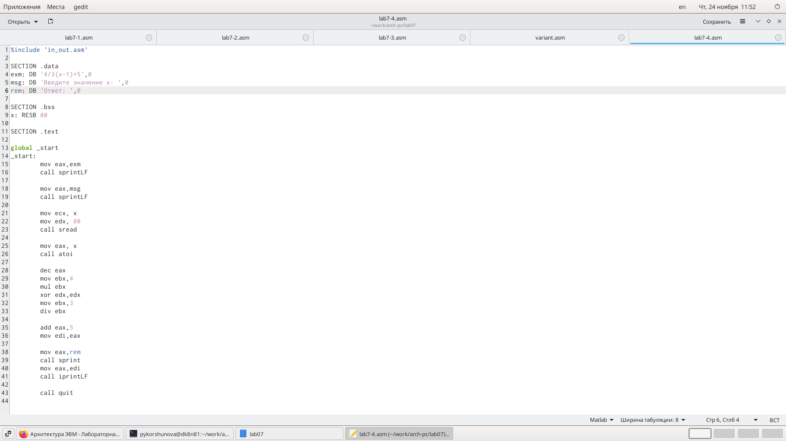{ #fig:015 width=90% }

2. Проверяю результат (рис. [-@fig:016])

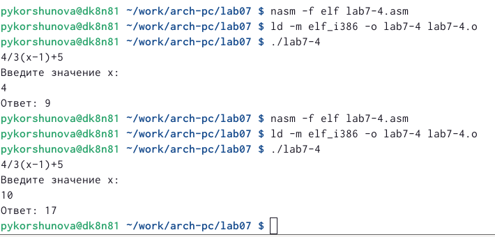{ #fig:016 width=90% }

# Выводы

Я освоила арифметические инструкции языка ассемблера NASM.

